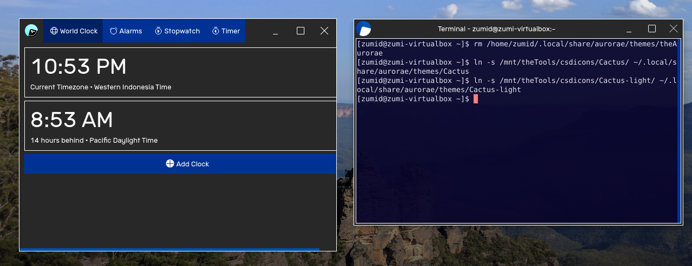

# Cactus (Kwin / Aurorae)

Theme matching the CSD look of Victor Tran's [theDesk](https://github.com/vicr123/thedesk)

## Preview

Shown here with the Contemporary widget theme.

## Install

Copy `Cactus` and `Cactus-light` over to `~/.local/share/aurorae/themes` and set it with KDE System Settings
